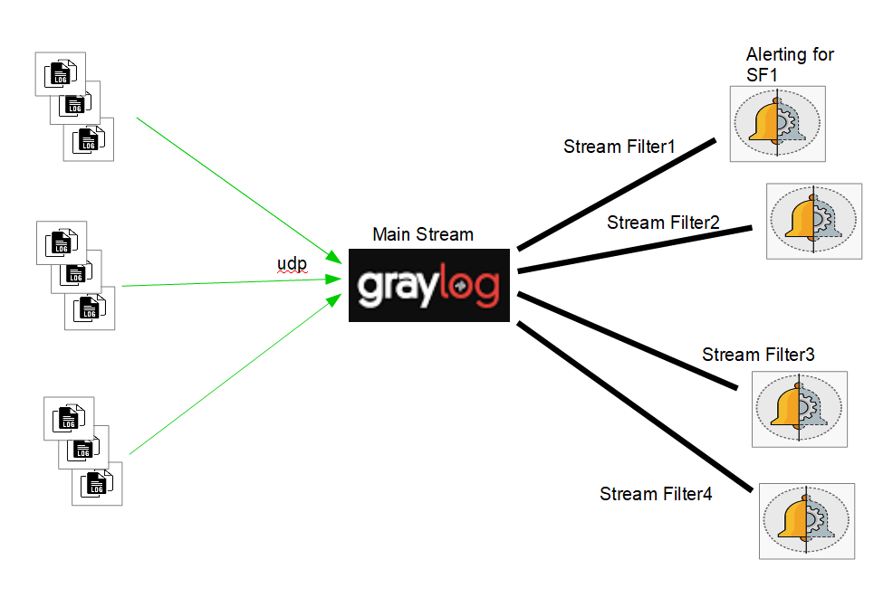
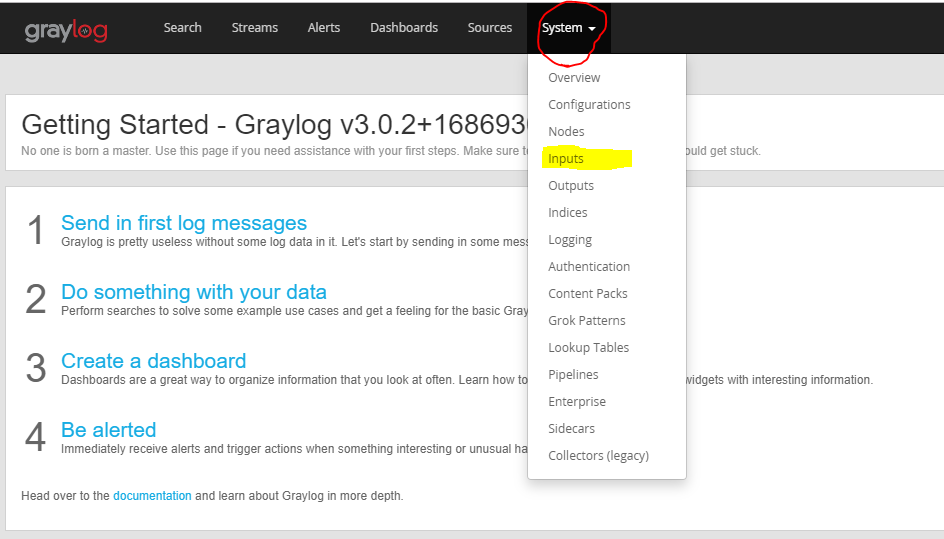
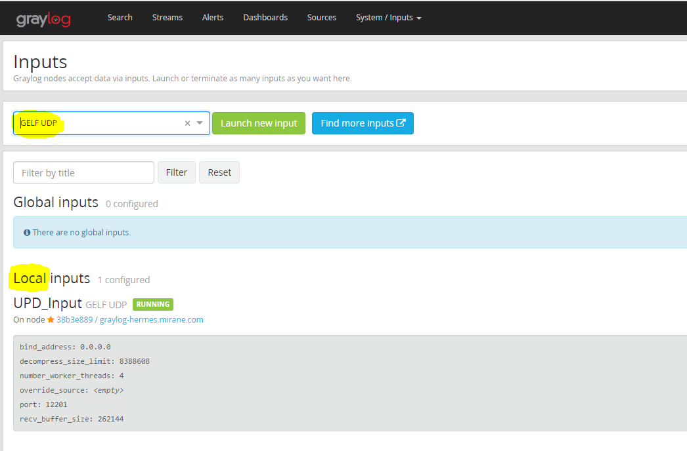
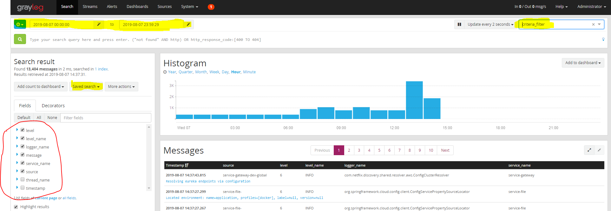
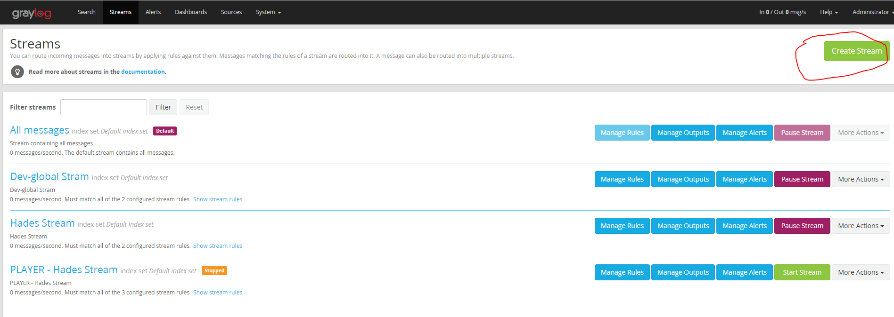
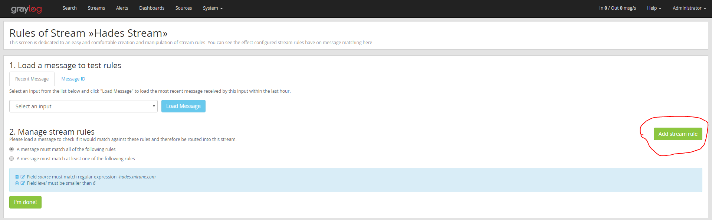
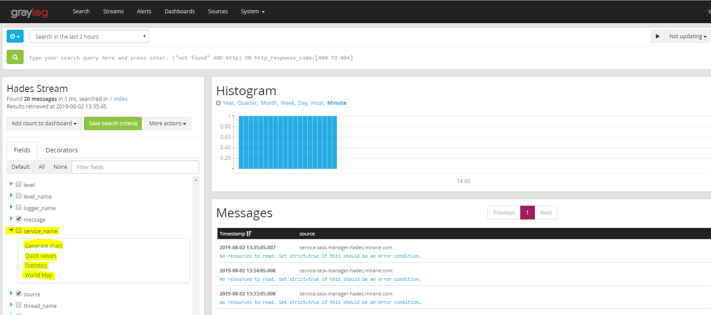
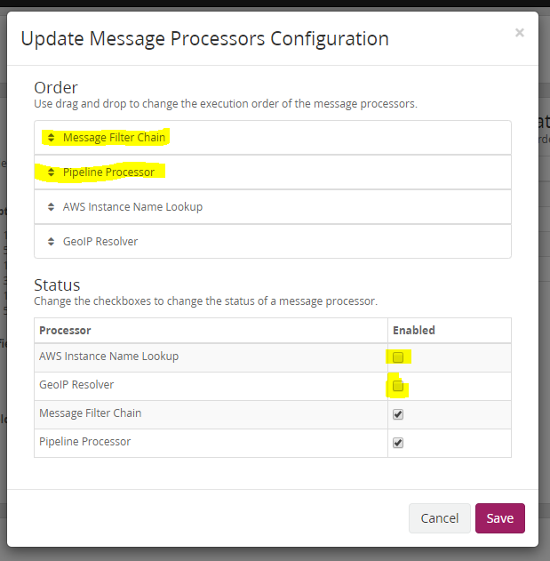

<div align="center">
  <a href="http://dev-global.mirane.com:3000/d/qPTfUOiiz/docker-and-system-monitoring?orgId=1&from=now%2Fd&to=now%2Fd">
    
  </a>
</div>


:star2: :star2: :star2: :star2: :star2: :star2: :star2: :star2: :star2: :star2: :star2: :star2: :star2: :star2: :star2: :star2: :star2: :star2: :star2: :star2: :star2: :star2: :star2: :star2: :star2: :star2: :star2: :star2: 
<div>
<H1 align="center" style="text-align: center">
       Monitoring
</H1>
</div>
:star2: :star2: :star2: :star2: :star2: :star2: :star2: :star2: :star2: :star2: :star2: :star2: :star2: :star2: :star2: :star2: :star2: :star2: :star2: :star2: :star2: :star2: :star2: :star2: :star2: :star2: :star2: :star2: 


Bienvenue sur la présentation du Monitoring des containers

Pour rappel, le **monitoring** est un capabilité d **Accelerate**


# Sommaire
- [**Présentation**](#présentation)
- [**Lien url**](#lien-url)
- [**Architecture**](#architecture)
- [**Outils**](#Outils)
- [**Arborescence**](#arborescence)
- [**Installation**](#installation)
- [**Exploitation**](#exploitation)
  - [**Start**](#start)
  - [**Stop**](#stop)
  - [**Restart**](#restart)
  - [**Status**](#status)
- [**Developer Configuration**](#developer-configuration)
- [**DevOps Configuration**](#devops-configuration)
- [**Contact**](#contact)


## Présentation <a name="Présentation"></a>

Le **monitoring** applicatif a pour objectif à **réduire** les temps de **détections d'erreurs** sur HV3.

Grâce à certains mécanismes, il est possible **d'améliorer la réactivité** sur erreur.

Un but serait d'**alerter** en **quelques secondes**.

A noter que Graylog est gratuit jusqu'à **5 GO de traffic par jour**.

## Lien url

<a href="http://hermes.mirane.com:9000">Hermes - IHM Graylog</a>

## Architecture

|          Architecture                               |                         Streams principle     |
|                   :----:                               |             :----:                     |                                                                                         
|                     |         |
## Outils

* <span style="color:blue"> Graylog </span> - Main Stream & IHM
* <span style="color:blue"> ElasticSearch </span> - Indexer for all messages
* <span style="color:blue"> MongoDB </span> - Stores Metadata


## Arborescence

```bash
/tmp/graylog
├── config
│   ├── graylog.conf    # Configuration file for Graylog
│   └── log4j2.xml      # Log Configuration file
├── docker-compose.yml
└── monitoring_manager.sh  # Manager for Graylog (Start/Stop/Restart/Status)
````

## Installation

PREREQUIS: <span style="color:red">Docker + Docker-Compose + Internet Access</span>.

https://docs.graylog.org/en/3.0/pages/installation/docker.html  (page officielle)

```bash
$ cd /tmp
$ git clone URL_DU_PROJET
$ cd monitoring-application
$ ./installer.sh
````

or

```bash
$ cd /tmp/graylog
$ docker-compose up -d
````

## Exploitation


### Start

```bash
$ cd /tmp/graylog
$ monitoring_manager start
````

### Stop

```bash
$ cd /tmp/graylog
$ monitoring_manager stop
````

### Restart

```bash
$ cd /tmp/graylog
$ monitoring_manager restart
````

### status

```bash
$ cd /tmp/graylog
$ monitoring_manager status
````

## Developer Configuration 

1) Edit the pom.xml with the graylog dependancies

```bash
        <dependency>
            <groupId>de.siegmar</groupId>
            <artifactId>logback-gelf</artifactId>
            <version>2.0.0</version>
        </dependency>
````
2) Add appenders in logback.xml

```bash
   <!-- Appenders GELF (Graylog) -->
    <conversionRule conversionWord="clr" converterClass="org.springframework.boot.logging.logback.ColorConverter" />
    <conversionRule conversionWord="wex" converterClass="org.springframework.boot.logging.logback.WhitespaceThrowableProxyConverter" />
    <conversionRule conversionWord="wEx" converterClass="org.springframework.boot.logging.logback.ExtendedWhitespaceThrowableProxyConverter" />
    <property name="CONSOLE_LOG_PATTERN" value="${CONSOLE_LOG_PATTERN:-%clr(%d{yyyy-MM-dd HH:mm:ss.SSS}){faint} %clr(${LOG_LEVEL_PATTERN:-%5p}) %clr(${PID:- }){magenta} %clr(---){faint} %clr([%15.15t]){faint} %clr(%-40.40logger{39}){cyan} %clr(:){faint} %m%n${LOG_EXCEPTION_CONVERSION_WORD:-%wEx}}"/>

    <appender name="STDOUT" class="ch.qos.logback.core.ConsoleAppender">
        <encoder>
            <pattern>${CONSOLE_LOG_PATTERN}</pattern>
            <charset>UTF-8</charset>
        </encoder>
    </appender>

    <appender name="GELF" class="de.siegmar.logbackgelf.GelfUdpAppender">
        <graylogHost>10.20.10.99</graylogHost>
        <graylogPort>12201</graylogPort>
        <useCompression>true</useCompression>
        <encoder class="de.siegmar.logbackgelf.GelfEncoder">
            <includeLevelName>true</includeLevelName>
            <staticField>service_name:service-business</staticField>
        </encoder>
    </appender>
````

````bash
	<root level="info">
        .....
        <appender-ref ref="GELF" />
        ....
	</root>
````

## DevOps Configuration 

1) Create an local GELF UDP input

|          POM.xml                               |                         Logback      |
|                   :----:                               |             :----:                     |                                                                                         
|                     |         |

2) Create a filter



3) Create Specific Streams 

|          Create                               |                         Add Rules      |
|                   :----:                               |             :----:                     |                                                                                         
|                     |         |


4) Edit Dashboards



5) Create Alerts (Conditions + Notifications)

6) Tuning 



## Contact

geoffrey.graveaud@zenika.com
</body>
</html>
