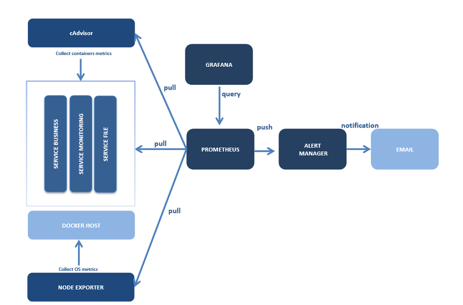

<div align="center">
  <a href="http://dev-global.mirane.com:3000/d/qPTfUOiiz/docker-and-system-monitoring?orgId=1&from=now%2Fd&to=now%2Fd">
    
  </a>
</div>


:star2: :star2: :star2: :star2: :star2: :star2: :star2: :star2: :star2: :star2: :star2: :star2: :star2: :star2: :star2: :star2: :star2: :star2: :star2: :star2: :star2: :star2: :star2: :star2: :star2: :star2: :star2: :star2: 
<div>
<H1 align="center" style="text-align: center">
       Monitoring
</H1>
</div>
:star2: :star2: :star2: :star2: :star2: :star2: :star2: :star2: :star2: :star2: :star2: :star2: :star2: :star2: :star2: :star2: :star2: :star2: :star2: :star2: :star2: :star2: :star2: :star2: :star2: :star2: :star2: :star2: 


Bienvenue sur la présentation du Monitoring des containers

Par rappel, le **monitoring** est une capabilité de **Accelerate**


# Sommaire
- [**Présentation**](#présentation)
- [**Lien url**](#lien-url)
- [**Architecture**](#architecture)
- [**Outils**](#Outils)
- [**Arborescence**](#arborescence)
- [**Installation**](#installation)
- [**Exploitation**](#exploitation)
  - [**Start**](#start)
  - [**Stop**](#stop)
  - [**Restart**](#restart)
  - [**Status**](#status)
- [**Configuration**](#configuration)
- [**Contact**](#contact)


## Présentation <a name="Présentation"></a>

Le **monitoring** des containers est une bonne pratique qui permet de **superviser** la consommation des **ressources** des containers.

La consommations des ressources est un **indicateur** à propos du **dysfonctionnement** des containers.

Les containers sont les **socles système** qui **héberge** les microservices de l'application **HighView3**.

Un container instable ralentit l'application et l'utilisateur qui se sert de l'outil.

L'**objectif** est d'**alerter** (dans un temps très raisonnable) **pour stabiliser**.


## Lien url

<a href="http://localhost:3000/d/qPTfUOiiz/docker-and-system-monitoring?orgId=1&from=now%2Fd&to=now%2Fd"> Grafana</a>

<a href="http://localhost:9090/graph">Prometheus</a> 

## Architecture


## Outils

* <span style="color:blue"> Prometheus </span> - Time Series DB
* <span style="color:blue"> Node Exporter </span> - Official Exporter for Prometheus
* <span style="color:blue"> Alert Manager </span> - Alerts Handler (Prometheus native)
* <span style="color:blue"> Grafana </span> -  Graphs and Monitoring Dashboards.
* <span style="color:blue"> cAdvisor </span> - Monitoring the Docker Container and System.
* <span style="color:blue"> Consul </span> - service discovery. Used to detect **HighView3** microservices
* <span style="color:blue"> registrator </span> - service registry for container detection

## Arborescence

```bash
monitoring
└── docker-compose.yml
alertmanager
└── config.yml         # Alerting configuration file
grafana
└──  dashboards        # Directory to store json dashboards
│   ├── Docker_and_system_monitoring.json
└── provisioning
    ├── dashboards
    │   └── db_prov.yml  # Configuration file for dashboards provisioning
    └── datasources
        └── ds_prov.yml  # Configuration file for datasources provisioning
prometheus
├── alert.rules        # Evaluation rules file
└── prometheus.yml     # Scrapes configuration file  
````

## Installation

PREREQUIS: <span style="color:red">Docker + Internet Access </span>.

```bash
$ cd /opt/gitlab
$ git clone URL_DU_REPO
$ cd monitoring-container
$ ./installer.sh
````

or

```bash
$ cd monitoring
$ docker-compose up -d
````

## Exploitation


### Start

```bash
$ cd monitoring
$ monitoring_manager start
````

### Stop

```bash
$ cd monitoring
$ monitoring_manager stop
````

### Restart

```bash
$ cd monitoring
$ monitoring_manager restart
````

### status

```bash
$ cd monitoring
$ monitoring_manager status
````

## Configuration

1) Edit sendmail.mc with the IP of Hostname

```bash
$ vi /etc/mail/sendmail.mc
````

Edit the following line

```bash
DAEMON_OPTIONS(`Port=smtp,Addr=IP_HOSTNAME, Name=MTA')dnl   ip host
````

2) Edit access file with the IP of alertmanager (given by installer.sh or by docker inspect command)

```bash
$ vi /etc/mail/access
````

Add lines :

```bash
# alertmanager container IP
Connect:ALERYMANAGER_IP_TO_CHANGE                    RELAY
````

3) Update sendmail.cf and restart daemon

```bash
$ make sendmail.cf
$ systemctl restart sendmail
````

4) Configure alertmanager config file

```bash
$ vi alertmanager/config.yml
````

Edit the following line with the correct hostname

```bash
smtp_smarthost: '[SERVER_NAME_TO_REPLACE]:25'
````

5) Restart alertmanager

```bash
$ docker restart monitoring_alertmanager
````

## Contact

geoffrey.graveaud@zenika.com
</body>
</html>
